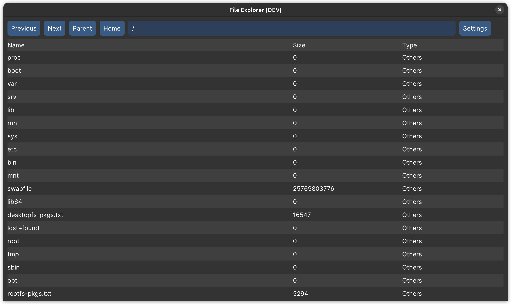

# Minimalist File Explorer

Minimalist File Explorer is a simple, lightweight file explorer built using C++, Dear ImGui and GLFW. It provides a minimal, clean interface for browsing files and folders on your computer.

Currently in development. Working with Linux (Gnome)

## Overview



## Features

- Browse files and folders on your computer
- Open files with default program
- Navigation using search bar with auto-completion
- Navigation to previous/next directories
- Filter files and folder
- Showing entry type
- Showing file size
- Hide/Show hidden files/folder
- VSync

## Dependencies

- [C++17](https://en.cppreference.com/w/cpp/17)
- [Dear ImGui](https://github.com/ocornut/imgui)
- [GLFW](https://www.glfw.org/)
- [fmt](https://github.com/fmtlib/fmt)

## Building

### Prerequisites

- [CMake](https://cmake.org/) (minimum version 3.7)
- A C++17 compatible compiler (e.g., GCC, Clang, or Visual Studio)

### Build Steps

1. Clone the repository:

```
git clone https://github.com/yourusername/minimalist-file-explorer.git
cd minimalist-file-explorer
git submodule update --init --recursive
```

2. Create a build directory and generate build files:

```
mkdir build
cd build
cmake ..
```

3. Compile the project:

```
cmake --build .
```

4. Run the executable:

```
./build/explorer
```

## Usage

After launching the application, navigate to your desired folder using the directory tree displayed on the left side of the window. Open a folder by clicking on the arrow icon beside it, or double-click the folder itself. Files in the selected folder will appear on the right side of the window, along with their file size and last modification date.

You can filter files based on their extensions using the search bar at the top of the window. To clear the filter, simply delete the text in the search bar (after the current path).

To open a file, simply double-click on it. The file will be opened using the default program associated with its extension.

To navigate to a previous/next directory, use the back/forward buttons at the top of the window.

To hide/show hidden files/folder, use the checkbox in the settings section.